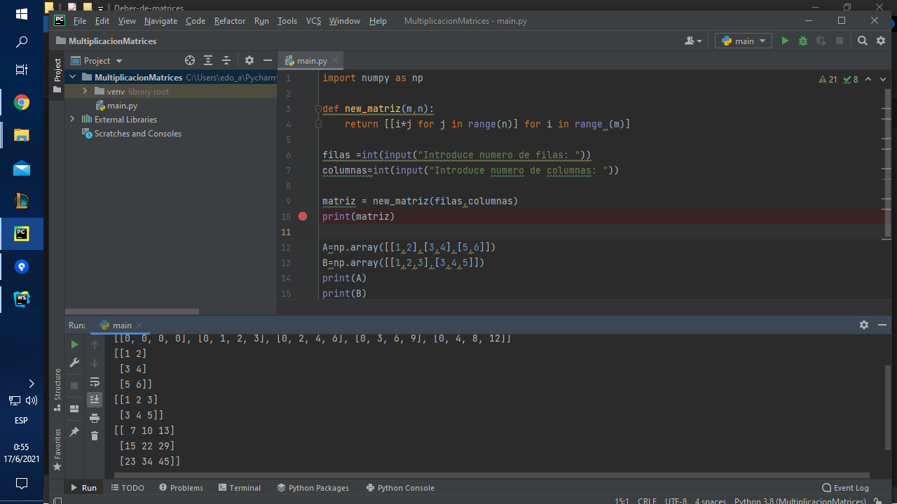

# Deber-de-matrices
Realizar una multiplicación de matrices, la cual tiene valores que son ingresados por el usuario. El usuario también debe definir la dimensión de las matrices. Subir en el aula virtual el código y captura de pantallas de la ejecución.
